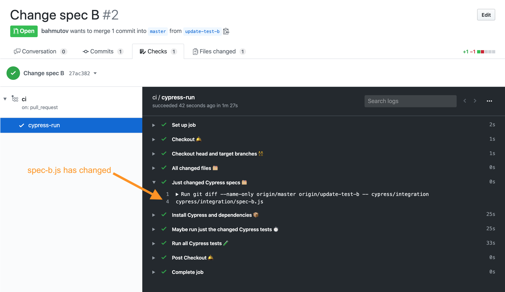
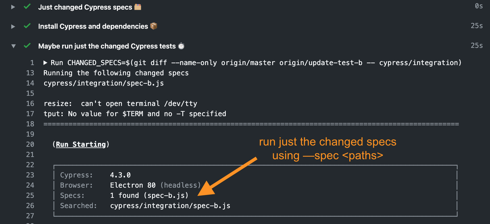
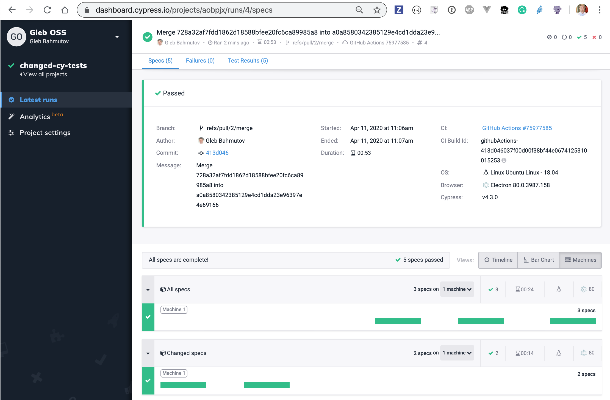

# changed-cy-tests [![ci status][ci image]][ci url]
> Example GitHub Action running changed Cypress specs against master first, then all the tests

Inspired by [Jest and the `--changedSince` flag in GitHub Actions CI](https://dev.to/bnb/jest-and-the-changedsince-flag-in-github-actions-ci-468i)

Example pull request [#2](https://github.com/bahmutov/changed-cy-tests/pull/2) with just changed file `spec-b.js`. The GitHub workflow [.github/workflows/ci.yml](.github/workflows/ci.yml) determines that this file has changed against the `master` branch and first runs just this spec. If that passes, then it runs ALL specs.

We determine the changed Cypress specs using the following `git` command (after checking out both head and base branches)

```sh
git diff --name-only \
  origin/${{ github.base_ref }} origin/${{ github.head_ref }} -- cypress/integration
```


Then if this returns something we can use `cypress run --spec ...` to run the changed specs first.

```sh
CHANGED_SPECS=$(git diff --name-only origin/${{ github.base_ref }} origin/${{ github.head_ref }} -- cypress/integration)
if [ -n "$CHANGED_SPECS" ]; then
  echo "Running the following changed specs"
  echo $CHANGED_SPECS
  npx cypress run --spec $CHANGED_SPECS
fi
```



And after that we can run all specs using [Cypress GitHub Action](https://github.com/cypress-io/github-action)

The combination of fail fast on the changed specs + run all specs afterwards feels good.

[Cypress Dashboard](https://dashboard.cypress.io/projects/aobpjx/runs/)



[ci image]: https://github.com/bahmutov/changed-cy-tests/workflows/main/badge.svg?branch=master
[ci url]: https://github.com/bahmutov/changed-cy-tests/actions
